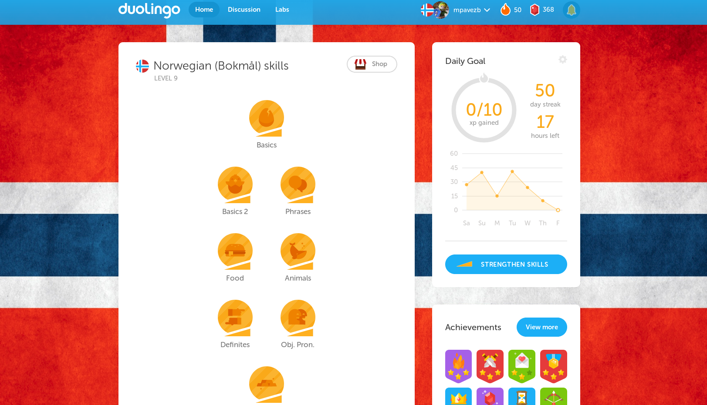

# duolingo
Scripts to enhance Duolingo experience.

## Duolingo country flags UserScript:

This UserScript modifies the duolingo webpage background by drawing a flag associated to the current language.

### Usage:

1. Install the Greasemonkey add-on on Firefox or the Tampermonkey add-on on Chrome.
2. Add the script manually or by using [this link](https://raw.githubusercontent.com/mpavezb/duolingo/master/duolingo_background_flags.user.js) (*monkey should recognize it automatically).
3. Enjoy!

PD. You can use any image you want for each of your languages. Just modify the link on the script code.
